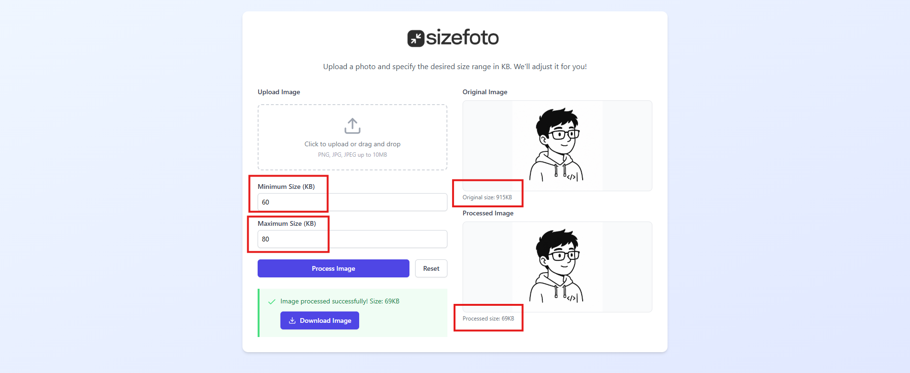

<div align="center">
  
  <h1>SizeFoto</h1>
  <p><strong>A simple and fast web app to resize and compress your images to a specific file size in KB.</strong></p>

  <p>
    <a href="https://sizefoto.vercel.app/" target="_blank"><b>View Live Demo</b></a>
  </p>

  <p>
    
    
    
    
  </p>
</div>

---

## 🌟 Overview

**SizeFoto** is a lightweight, browser-based tool that allows you to easily resize or compress your images. If you've ever needed an image to be strictly between, say, 50KB and 100KB for an online application or document submission, SizeFoto handles the scaling and compression logic automatically within your browser. 

<div align="center">
  
</div>

## ✨ Features

- 🎯 **Precise File Sizing**: Specify minimum and maximum file size bounds (in KB). The app iteratively adjusts dimensions and quality to fit your criteria perfectly.
- 🔒 **Client-Side Processing**: All image processing happens locally in your browser using the HTML5 Canvas API. **Your images never leave your device, ensuring complete privacy.**
- 👁️ **Live Preview**: Instantly see the original and processed image alongside their respective file sizes.
- ⬇️ **Easy Download**: One-click download for your processed image.
- 📱 **Responsive Design**: Beautiful, user-friendly, and mobile-ready interface built with Tailwind CSS.

## 🚀 Tech Stack

- **Framework**: React 18
- **Build Tool**: Vite
- **Language**: TypeScript
- **Styling**: Tailwind CSS
- **Icons**: Lucide React

## 🔗 Live Application

Try the app now: **[https://sizefoto.vercel.app/](https://sizefoto.vercel.app/)**

## 💻 Getting Started

To run this project locally, follow these steps:

### Prerequisites

- Node.js (v18 or higher recommended)
- npm, yarn, or pnpm

### Installation

1. **Clone the repository** (or download the source):
   ```bash
   git clone <your-repo-url>
   cd sizefoto
   ```

2. **Install dependencies**:
   ```bash
   npm install
   ```

3. **Start the development server**:
   ```bash
   npm run dev
   ```

4. Open your browser and navigate to the local URL provided in the terminal (usually `http://localhost:5173`).

## 🛠️ How It Works

Under the hood, SizeFoto leverages the HTML5 `<canvas>` element to read your uploaded image and apply a binary search approach on image quality. 
If lowering the quality isn't enough to meet the size requirements, the app intelligently downscales the image dimensions iteratively until the target constraints are met. 
Conversely, if an image is smaller than the minimum size limit, it can scale the image up smoothly.

## 📜 License

This project is open-source and available under the [MIT License](LICENSE).